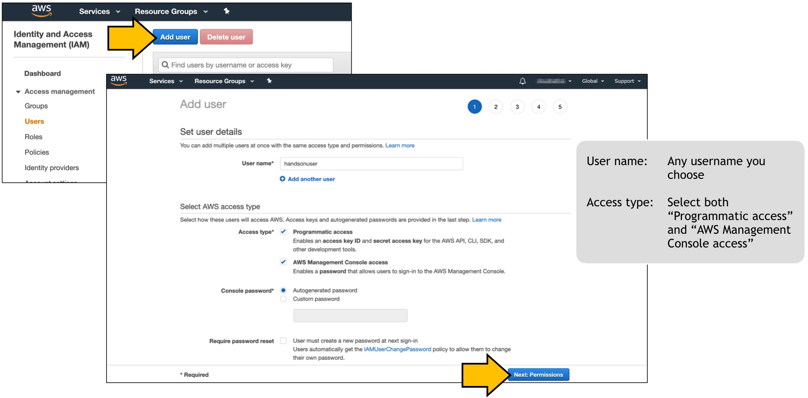

# Tutorial: チュートリアル

**Difficulty:** Tutorial - チュートリアル

**Scenario goal:**

Get to know the workflow and prepare for hands on.  
ハンズオンの準備とテスト

**Command:**
```
$ cd scenarios/00-tutorial
```

**Resources to be deployed:**

* 1 VPC with:
  * EC2 x 1

## Summary

In this scenario, let's learn how to prepare your aws account and how to install terraform on your machine, then we will go through the basic scenario to check if every workflow works fine.

AWSアカウントの用意の仕方からterraformのインストール方法、そしてシナリオの基本的なワークフローを学んでいきましょう。

## Guide chart


## Guide

1. Follow below screenshot to create an IAM user.

>
>
>

Once you created user, let's check if it works.
Open the console URL in your browser, and key in your credential. You should be able to login to AWS web management console.

>

2. Setup AWS credential in your machine. You should follow [the official document](https://docs.aws.amazon.com/cli/latest/userguide/install-cliv2.html) to install aws cli on your machine. Once installed, you need to configure the credential as below.
```
$ aws configure
AWS Access Key ID [None]: AKIA********
AWS Secret Access Key [None]: ********
Default region name [None]: us-east-1
Default output format [None]: 
$ 
```
Once configured, let's check if it works. Open your terminal, and issue `aws ec2 describe-vpcs` command. it should return an array of vpcs as below(this image has 0 element, while you may have a few):
```
$ aws ec2 describe-vpcs
{
    "Vpcs": []
}
```

3. Install terraform on your machine. Terraform is a single binary and usually you just need to download it and add it to your `PATH`. Please refer [the official guide](https://www.terraform.io/downloads.html).

4. Now all preparation has been done. Let's deploy the first resources using terraform!

Move to the scenario directory:
```
$ cd terraform
$ pwd
/xx/cloud-network-troubleshoot/scenarios/00-tutorial/terraform
```

Initialize terraform in the directory:
```
$ terraform init

Initializing the backend...

Initializing provider plugins...
- Checking for available provider plugins...
- Downloading plugin for provider "aws" (hashicorp/aws) 2.67.0...
- Downloading plugin for provider "tls" (hashicorp/tls) 2.1.1...
...
```

Check if there is any syntax issues in terraafom files:
```
$ terraform plan
(this will list all the resources to be deployed)
Refreshing Terraform state in-memory prior to plan...
...
Plan: 10 to add, 0 to change, 0 to destroy.
```

Now, it's time to deploy these resources on the cloud. Planned resources are shown again, and you need to confirm by typing "yes" once prompted.
```
$ terraform apply

An execution plan has been generated and is shown below.
Resource actions are indicated with the following symbols:
...
Plan: 10 to add, 0 to change, 0 to destroy.

Do you want to perform these actions?
  Terraform will perform the actions described above.
  Only 'yes' will be accepted to approve.

  Enter a value: yes
...
Apply complete! Resources: 10 added, 0 changed, 0 destroyed.

Outputs:

goal = Open your web browser and navigate to the server public ip. In this quiz, you should be greeted with message straight away!

goal_jp = WEBブラウザでサーバのパブリックIPを開けてください。問題がなければメッセージが表示されるはずです！

server_public_ip_address = x.x.x.x
```

And once completed, don't forget to delete these resources. Again it will prompt you to type "yes" to confirm deletion.
```
$ terraform destroy
tls_private_key.my_key: Refreshing state... 
...
  Enter a value: yes
...
Destroy complete! Resources: 10 destroyed.
$ 
```

And it is always a agood idea to navigate to web management console to confirm if any resources are left not deleted.

## Comment

Conguratulations! You just entered a realm of Infrastructure as a Code(IaaC) :)  
おめでとうございます！インフラストラクチャーアズアコードの世界に一歩足を踏み入れました :)  

この方法のチートシートは[こちら](./cheat_sheet.md).
