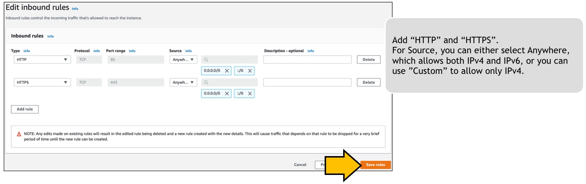

# Scenario: Web server is not working! No. 1 - ウェブサーバが動かない。その1

## Walkthrough

Deployed sources and access flow:

1. First, let's check what is deployed.

Seeing this, you can see what instances are deployed what resources are deployed for this scenario. Now we can see 6 resources here.

2. It depends on you where to start, but in this scenario we take a look at security group. Click the security group identifier in the tag editor will open another tab to show you the resource.

There is no inbound rule configured in this security group and it is the resaon the web server is not reachable. AWS security group has an implicit deny at the end, and if you don't have specific rule the traffic will never reaach the server. The security group is deployed as netfilter in aws host server, so it will be evaluated after network routing, but before the traffic hits the actual vm guest(web server).

3. Add a rule to allow web traffic. Click "Edit inbound rules", and click "Add rule".

4. Now shou should be able to browse the web page.

