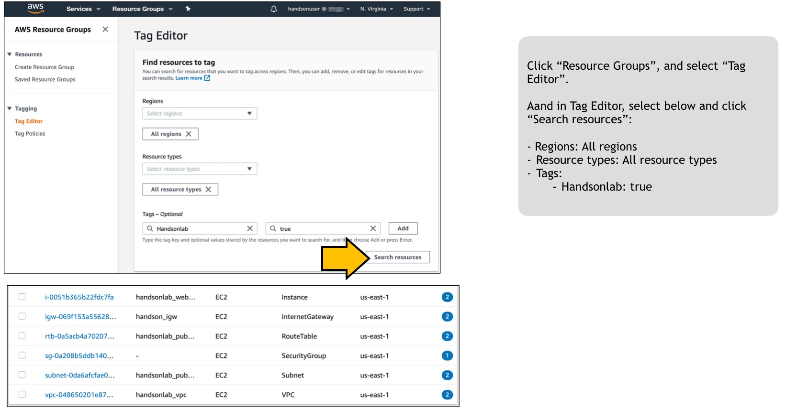

# Scenario: Web server is not working! No. 2 - ウェブサーバが動かない。その2

## Walkthrough

Deployed sources and access flow:

1. First, let's check what is deployed.

Seeing this, you can see what instances are deployed what resources are deployed for this scenario.

2. It depends on you where to start, but in this scenario we take a look at Network ACLs. Click the NetworkACL identifier in the tag editor will open another tab to show you the resource.

There is no outbound rule configured in this network acl and it is the resaon the web server is not reachable.  
It's similar to the ACL in Cisco router if you are familiaar with Cisco. And it's stateless. It means it doesn't allow returning traffic even if there is an allowing rule for inbound http - the network acl evaluates the traffic regardless of the context.  
Differences compared to Security Groups are:
- Security Groups are stateful - it allows returning traffic if there is an existing associated session
- The scope of Security Groups is instance wide, while the scope of NACL is subnet(vpc) wide.

3. Add a rule to allow outbound traffic. Click "Edit outbound rules", and click "Add rule".

Note I add the rule which is very permissive and you might want to change this. Do remember though, this parameter is applied for source and not for destination.

4. Now shou should be able to browse the web page.

