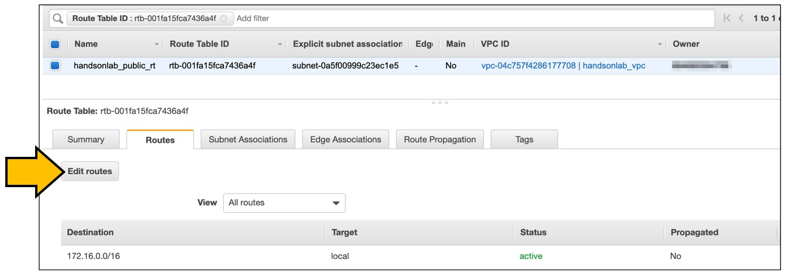
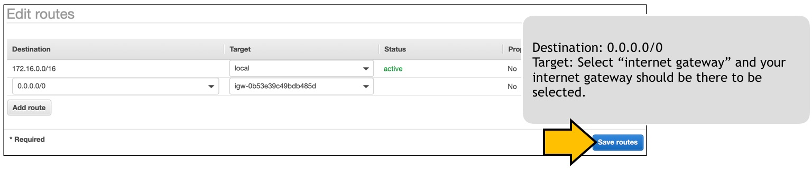

# Scenario: Web server is not working! No. 3 - ウェブサーバが動かない。その3

## Walkthrough

Deployed sources and access flow:

1. First, let's check what is deployed.

Seeing this, you can see what instances are deployed what resources are deployed for this scenario.

2. It depends on you where to start, but in this scenario we take a look at Route Table. Click the route table identifier in the tag editor will open another tab to show you the resource.

There is no route back to the client and it is the resaon the web server is not reachable. 172.16.0.0/16 is the VPC network which is added  by default.   
It's just like a routing  table in any network devices, and not having a default route makes the server not reachable from anywhere, mspecifically the traffic does reach the  server, but the returning traffic never sent back to the original requester.  

3. Now, let's add a route to the internet. I have deployed a internet gatewaay which act as an internet perimeter between your VPC and the outer world. Select "Edit route" in route table, and follow the image below:

4. Now shou should be able to browse the web page.

