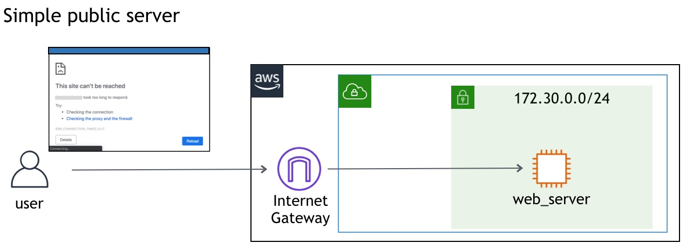
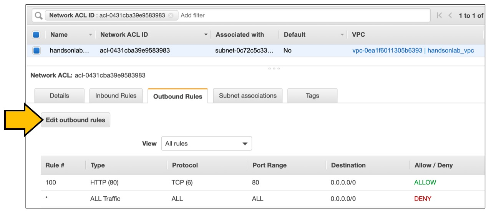
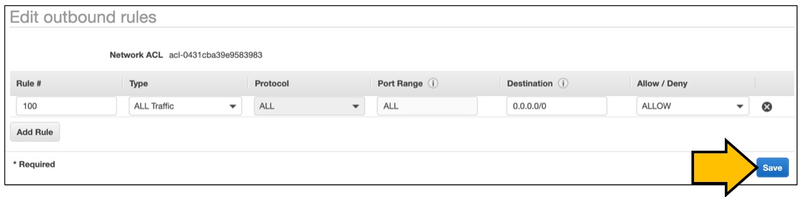

# Scenario: Web server is not working! No. 4 - ウェブサーバが動かない。その4

## Walkthrough

Deployed sources and access flow:

1. First, let's check what is deployed.

Seeing this, you can see what instances are deployed what resources are deployed for this scenario.

2. It depends on you where to start, but in this scenario we take a look at Network ACLs. Click the Network ACL identifier in the tag editor will open another tab to show you the resource.

There is a rule to allow outbound traffic going to port 80. However, this rule is not correct as the network ACL is for destination port and not for source port. Hence I just allow all outbound traffic as below:

4. Now you should be able to browse the web page.

