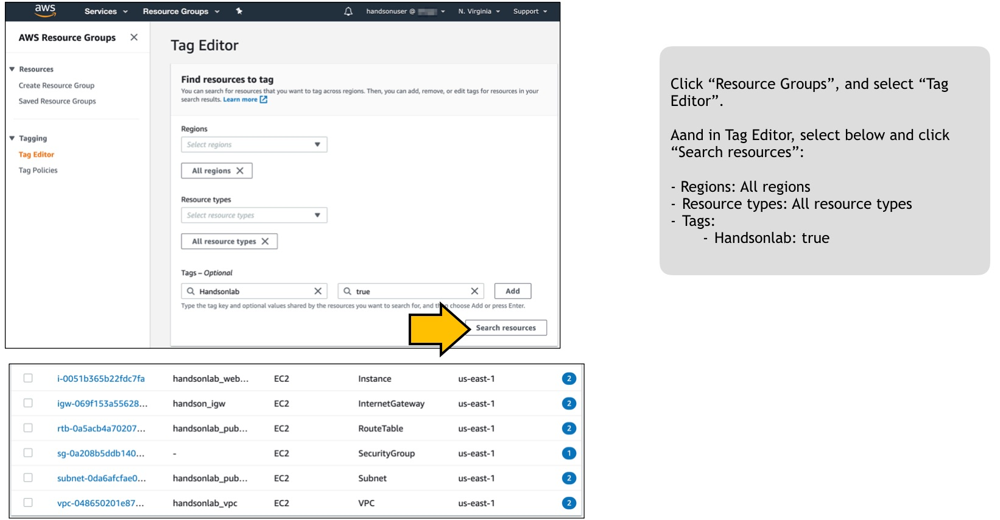
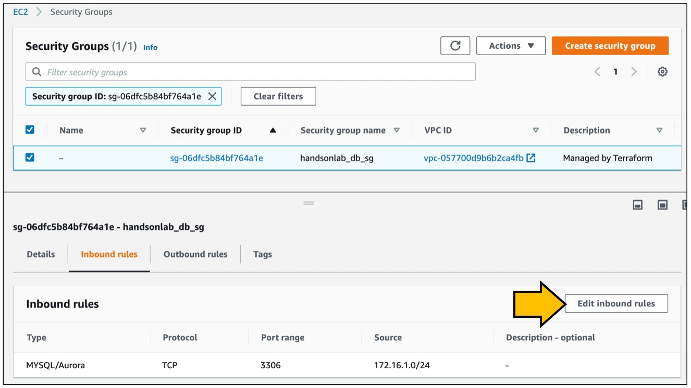
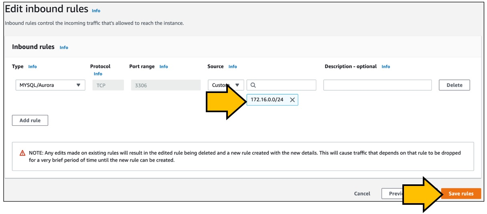

# Scenario: Connection to DB server lost! No. 2 - DBサーバへの接続が切れた。その2

## Walkthrough

Deployed sources and access flow:

1. First, let's check what is deployed.

Seeing this, you can see what instances are deployed what resources are deployed for this scenario.

2. It depends on you where to start, but in this scenario we take a look at Security group for DB. Click the Security group identifier in the tag editor will open another tab to show you the resource.

I'm using mariadb on port tcp/3306, but it appears there is a mistake on the source subnet. As you can see in the diagram above, the web server is in 172.16.0.0/24 and not in 172.16.1.0/24.  
Let's modify this rule to allow connection from web server subnet(172.16.0.0/24)

4. Now press the button on the web site, and you should get an image.

