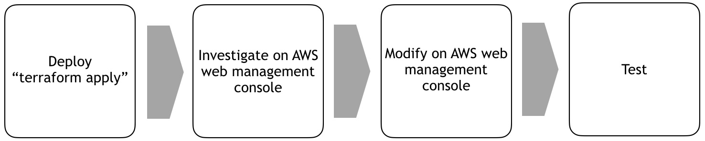

# Scenario: Connection to DB server lost! No. 3 - DBサーバへの接続が切れた。その3

**Difficulty:** Easy - 簡単

**Scenario goal:**

Make the web site work again.
ウェブサーバを正常化する。

**Command:**
```
$ cd scenarios/07-aws/asset
$ terraform init
$ terraform apply
(once completed)
$ terraform destroy
```

**Resources to be deployed:**

* 1 VPC with:
  * EC2 x 2
    * Web ... using flask, serving on tcp port 80
    * DB ... using mariadb, serving on tcp port 3306

## Summary

You are building a two tier web application. Frontend is running web server and application, and some part it retrieves data from backend DB server. As you are a Linux expert, you deployed both frontend(web) and backend(db) without any problem. However the frontend cannot collect the data from backend server. Your goal is to change a configuration in AWS and make it work. Once you completed, you will see a random image every  time you press button.

あなたはフロントエンドとバアックエンドで構成されるWEBアプリを構築しています。Linuxマスターであるあなたはフロントエンドとバックエンドをものの5分で構築してしまいました。しかし、WEBサイトはうまく動いていないようです。AWSの設定をどうにか変更してWEBサイトを正常化させましょう。うまくいけば、ランダムで画像が表示されます。

## Guide chart



## Guide

1. Apply terraform file and deploy resources on AWS by issueing `$ terraform apply`.

2. Check if web site is reachable. And confirm it is reachable.

3. Click the button, and check if it doesn't show you an image.

4. Login to your aws management console, and check what is not configured correctly.

5. Once you modified the parameters on AWS, check web browser if it works ok.

6. `$ terraform destroy`

7. Login to your aws again and confirm no resources are left not to be deleted.

この方法のチートシートは[こちら](./cheat_sheet.md).

## Comment
🎉
Conguratulations! 
おめでとうございます！

