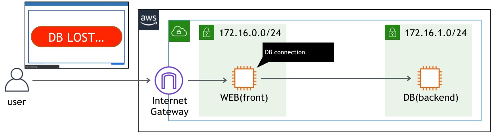
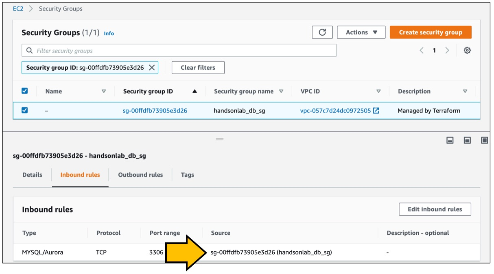
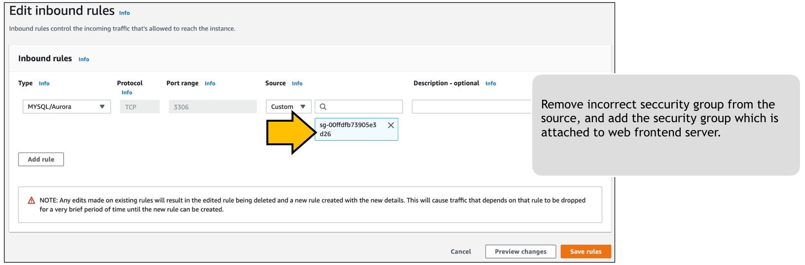

# Scenario: Connection to DB server lost! No. 2 - DBサーバへの接続が切れた。その2

## Walkthrough

Deployed sources and access flow:

1. First, let's check what is deployed.

Seeing this, you can see what instances are deployed what resources are deployed for this scenario.

2. It depends on you where to start, but in this scenario we take a look at Security group for DB. Click the Security group identifier in the tag editor will open another tab to show you the resource.

I'm using mariadb on port tcp/3306, but it appears there is a mistake on the source security group. Here, the access to tcp/3306 is allowed for those instances which has a security group "xxx-db-sg" attached to them. In our case though, web server has security group of "xxx-web-sg", and it needs to be allowed to access DB.    
Let's modify this rule to allow connection from web server security group(xxx-web-sg). Simply remove the unnecessary source security group, and select the web security group from the dropdown.

4. Now press the button on the web site, and you should get an image.

