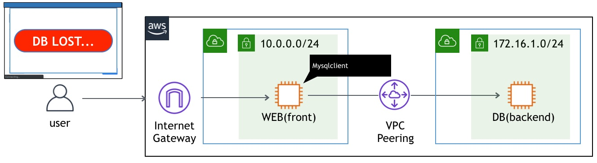
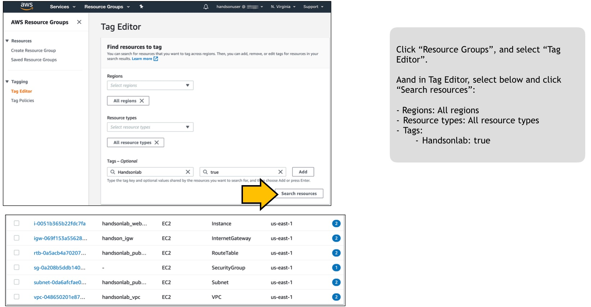
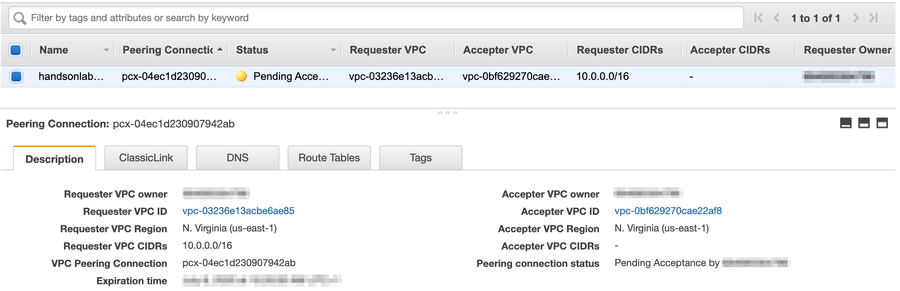
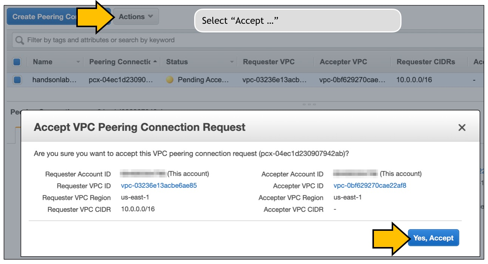

# Scenario: Connection to DB server lost! No. 3 - DBサーバへの接続が切れた。その3

## Walkthrough

Deployed sources and access flow:

1. First, let's check what is deployed.

Seeing this, you can see what instances are deployed what resources are deployed for this scenario.
2. It depends on you where to start, but in this scenario we take a look at VPC Peering. Click the VPC peering identifier in the tag editor will open another tab to show you the resource.

In order to communicate between two separate VPCs, you have a few options:

VPC peering ... This is the easiest. Connect two AWS VPCs. Obviously it can be used only if both sides are using AWS.
VPN connection ... This is the same as old days IPsec connection. It has more flexibility and isolation, but it requires more configuration. It can connect any network as long as it can be connected over IPsec.
Transit Gateway ... This can be used for multipoint connectionn, while above connection type is used only for one to one connection.

In this example, I used VPC peering. To setup VPC peering, you have three steps:
>1. Create a VPC peering in either side of VPC
>2. Accept the VPC peering request in the other side of VPC
>3. Create aa route table entry to direct the traffic to use VPC peering for specific subnet.

In this quiz, the VPC peering request had been submitted, but it was not accepted by the destination VPC.

Let's accept the vpc peering connection! Navigate "Actions" > "Accept..." and click "Yes, Accept".

I have already setup routes in the route table, so it does not necessary.

4. Now press the button on the web site, and you should get an image.

