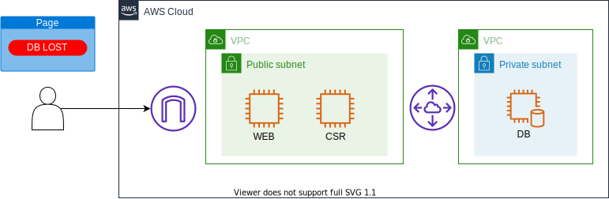
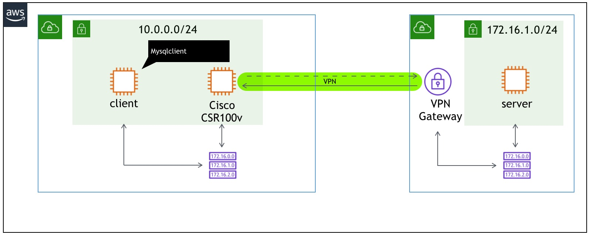
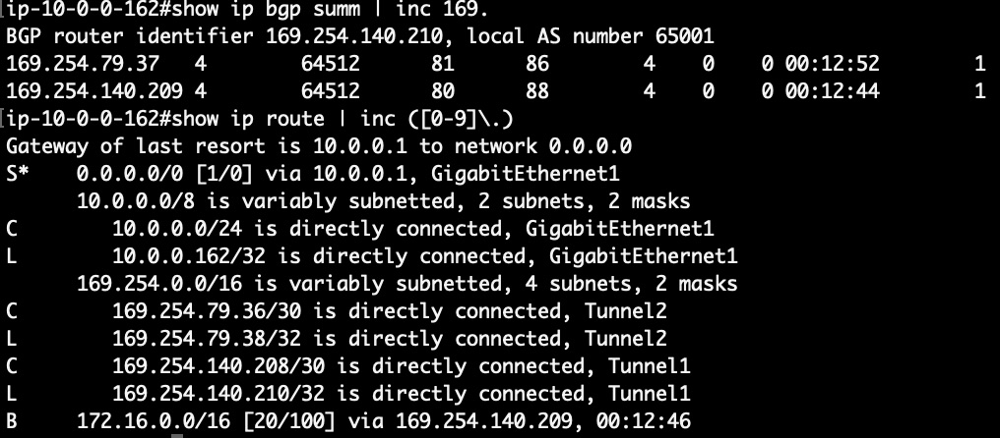
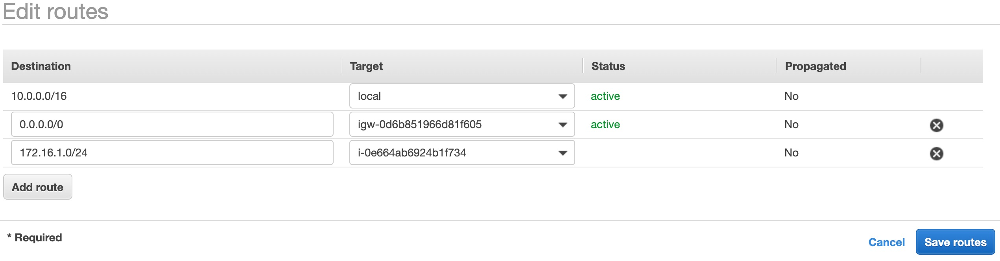

# Scenario: Connection to DB server lost! No. 6 - DBサーバへの接続が切れた。その6

## Walkthrough

Deployed sources and access flow:

1. First, let's check what is deployed.

Seeing this, you can see what instances are deployed what resources are deployed for this scenario.
2. It depends on you where to start, but in this scenario we take a look at route table for frontend. Click the route table identifier in the tag editor, and it will open another tab to show you the resource.

In order to communicate between two separate VPCs, you have a few options:

* VPC peering ... This is the easiest. Connect two AWS VPCs. Obviously it can be used only if both sides are using AWS.
* VPN connection ... This is the same as old days IPsec connection. It has more flexibility and isolation, but it requires more configuration. It can connect any network as long as it can be connected over IPsec.
* Transit Gateway ... This can be used for multipoint connectionn, while above connection type is used only for one to one connection. It is introduced in 2018, and it dramatically reduces the tasks if you have many site to communicate n:n.

In this example, I used VPN connection. To setup VPN connection, you need to follow these three steps:

>1. Create a VPN Connection(Customer Gateway, VPN Gateway, VPN) in AWS
>2. Configure VPN in your choice of device/service to connect to VPN connection you created in above step.
>3. Change your internal routing(in our case, route table) so that the traffic to the destination is directed to the VPN device(CSR1000v).

Once you created a VPN connection in AWS, you can download pre-rendered configuration from the AWS portal for major vendor(e.g. Juniper, Cisco). And most of the cases you should be able to import those configuration into your device with minimum changes in downloaded config.

In this quiz, there is no route added into frontend subnet route table, and it caused the communication loss just like below image:

As you can see in Cisco csr1000v output as below, the router does receives the route from its peer in AWS.

However the route for DB subnet(172.16.1.0/24) is not propagated into route table. And it's not possible to synchronize csr1000v(on EC2 instance) routing table with subnet's route table in AWS. In short, you need to add the route manually.

From routing table page, navigate to "Edit routes" > "Add route" and fill int he field as below:
* Destination ... 172.16.1.0/24(the subnet DB is in)
* Target ... Select "instance" and select CSR1000v instance.
Click "Save routes" and it's done!

4. Now press the button on the web site, and you should get an image.

