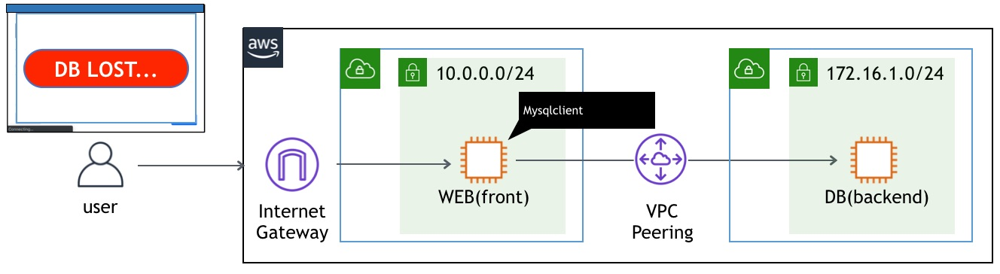
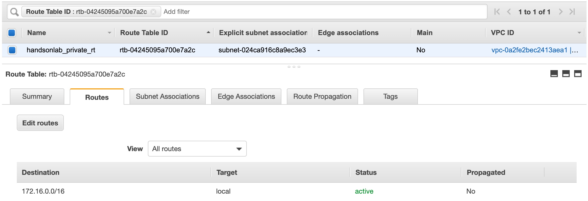
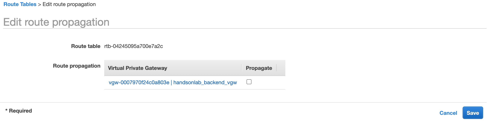

# Scenario: Connection to DB server lost! No. 6 - DBサーバへの接続が切れた。その6

## Walkthrough

Deployed sources and access flow:

1. First, let's check what is deployed.

Seeing this, you can see what instances are deployed what resources are deployed for this scenario.
2. It depends on you where to start, but in this scenario we take a look at route table for backend. Click the route table identifier in the tag editor, and it will open another tab to show you the resource.

Having checked the route table, it seems the route back to frontend is not added to the route table.

In order to communicate between two separate VPCs, you have a few options:

* VPC peering ... This is the easiest. Connect two AWS VPCs. Obviously it can be used only if both sides are using AWS.
* VPN connection ... This is the same as old days IPsec connection. It has more flexibility and isolation, but it requires more configuration. It can connect any network as long as it can be connected over IPsec.
* Transit Gateway ... This can be used for multipoint connectionn, while above connection type is used only for one to one connection. It is introduced in 2018, and it dramatically reduces the tasks if you have many site to communicate n:n.

In this example, I used VPN connection. To setup VPN connection, you need to follow these three steps:

>1. Create a VPN Connection(Customer Gateway, VPN Gateway, VPN) in AWS
>2. Configure VPN in your choice of device/service to connect to VPN connection you created in above step.
>3. Change your internal routing(in our case, route table) so that the traffic to the destination is directed to the VPN device(CSR1000v).

In this quiz, all steps mentioned above are correctly configured. However there is another step you need to do, and that is a route table configuration. Here, you have a two ways to do this:
* Set route table to accept the subnet advised from customer gateway 
* Set the route manually on route table

I use first option here. From route table page, go to "Route propagation" > "Edit route propagation", and check the "propagate" box. 

4. Now press the button on the web site, and you should get an image.

