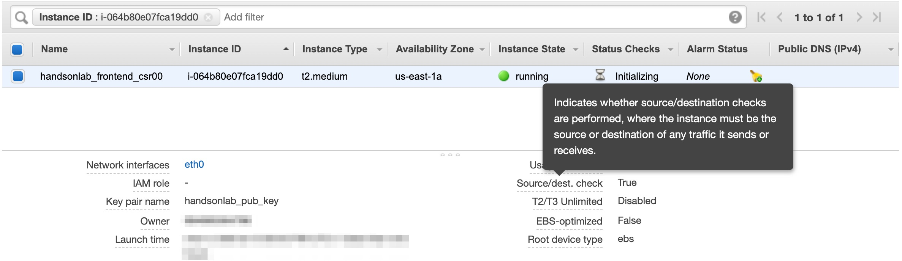
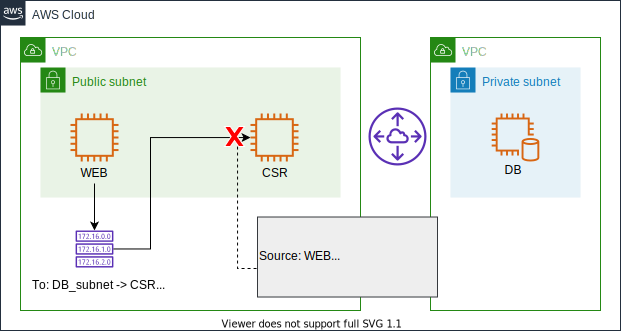
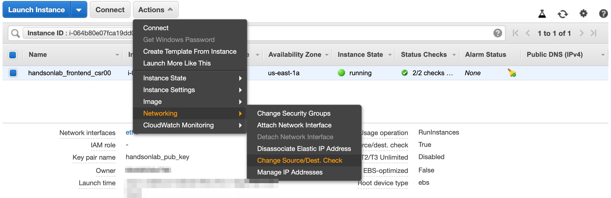

# Scenario: Connection to DB server lost! No. 8 - DBサーバへの接続が切れた。その8

## Walkthrough

Deployed sources and access flow:

1. First, let's check what is deployed.

Seeing this, you can see what instances are deployed what resources are deployed for this scenario.
2. It depends on you where to start, but in this scenario we take a look at CCSR1000v EC2 instance. Click the EC2 identifier in the tag editor, and it will open another tab to show you the resource.

Having checked the instance detail, the "Source/dest. Check" is enabled. As it is described in the image, the traffic will be discarded even before it  reaches EC2 instance. 

As this EC2 instance is used for routing, this check needs to be disabled. This value is set to enabled by defaul wthen you create an EC2 instance. To disable, navigate to "Actions" > "Networking" > "Change Source/Dest. Check" and select "Yes, Disable".

4. Now press the button on the web site, and you should get an image.

