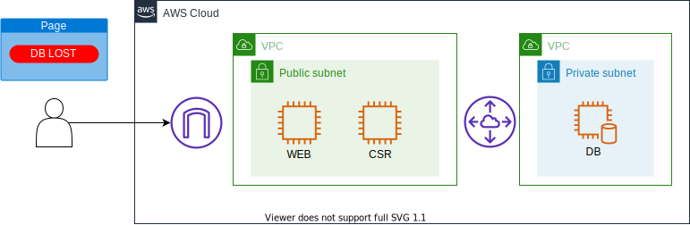
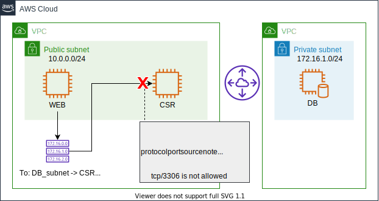
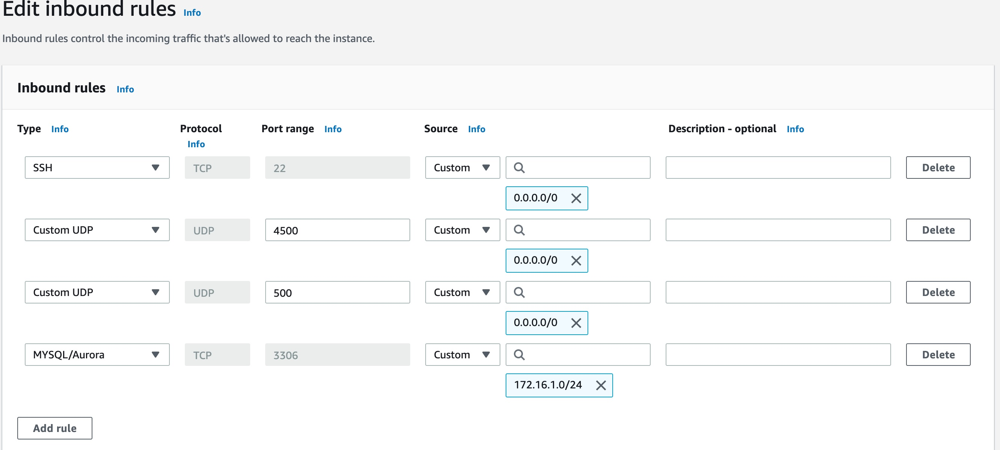

# Scenario: Connection to DB server lost! No. 9 - DBサーバへの接続が切れた。その9

## Walkthrough

Deployed sources and access flow:

1. First, let's check what is deployed.

Seeing this, you can see what instances are deployed what resources are deployed for this scenario.
2. It depends on you where to start, but in this scenario we take a look at the security group attached to CSR1000v EC2 instance. Click the security group identifier for csr identifier in the tag editor, and it will open another tab to show you the resource.

Having checked the security group detail, there is no rule allowing the communication from the web server to db server. As it is described in the image, the traffic needs to be allowed in security group. 

In order to allow this traffic, simply add another rule into the seccurity group. In this case, I added the rule allowing the communication for anny traffic goinng to DB subnet(172.16.1.0/24) and it has destination port tcp/3306.

4. Now press the button on the web site, and you should get an image.

